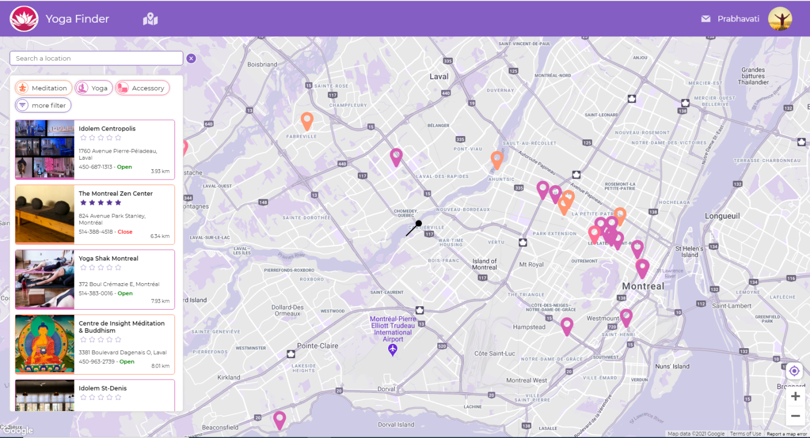
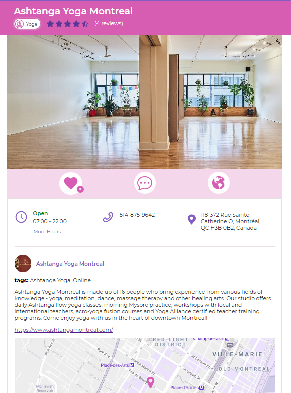
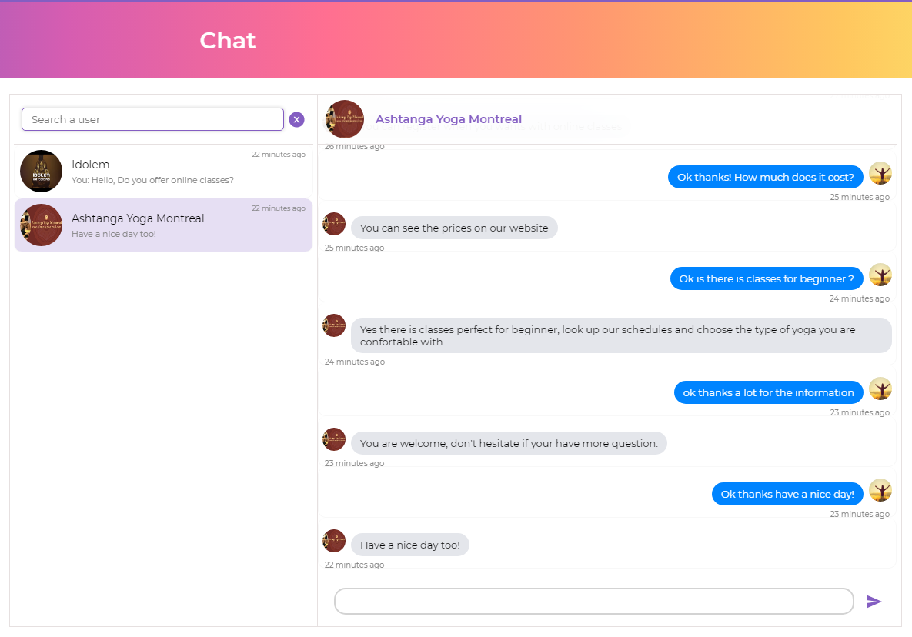

# Yoga finder with google map API and a private chat using MERN stack and socket-io

## Introduction

This is my final project for the Concordia web development bootcamp.
The Yoga Finder Project gives you the opportunity to search for yoga and meditation centers as well as yoga accessory stores in your area (in Canada). The map is the main tool of your search, you will see the position of the businesses you are looking for and a list of businesses sorted by proximity from a central location of your choice. You can use filters to refine your search.
The yoga centers can be rated and received comments and can be added to your favorites. You also have the option to chat with the owner and other users of the app.
If you are a owner of this type of business you can add it to the application.
\*\*\* All the businesses in the app have been added by me and not the real owner of the business as a demonstration purpuse only.

## Youtube demo

https://youtu.be/x5w83U-iFjg

## Technologies

React, Redux, styled-components, Nodejs, Express, MongoDb and Mongoose, socket-io, jsonwebtoken, bcryptjs, jwt-decode.
The map uses Google map API with @react-google-maps/api and use-places-autocomplete

## The project features list

-   Search for yoga or meditation centers and accessory stores in Canada with a map.
-   Search for businesses in your area.
-   Search filters on the type of company and other criteria
-   See the details of these centers and a way to reach them
-   Log in and register with the app to access more features.
-   Add or remove yoga centers from your favorites
-   Rate and comment on the yoga center of your choice,
-   use the private chat to communicate with the owner and other users of the application
-   add and modify your own yoga and meditation centers or accessory stores.
-   the application is responsive and ok with desktop, tablet and phone format.

Single page exemple:

Example of the chat with a fictitious conversation for the purpose of demonstration

